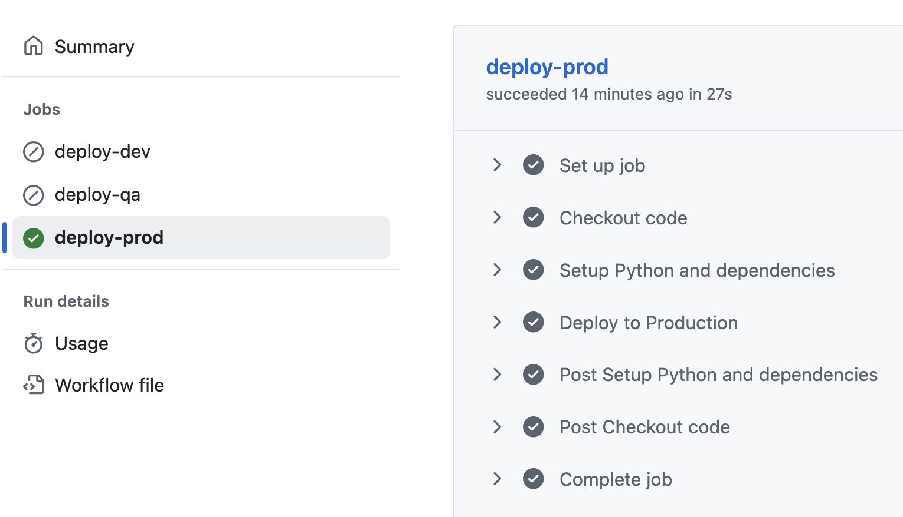

# Challenge: CI/CD with GitHub Actions

[](https://github.com/caterinamennito/challenge-ci-cd-github/actions/workflows/ci.yml)
[](https://github.com/caterinamennito/challenge-ci-cd-github/actions/workflows/cd.yml)

A **Streamlit application** demonstrating **CI/CD pipelines** with GitHub Actions, featuring automated testing and deployment to multiple environments.

## 🎯 Project Overview

This project implements a complete **DevOps pipeline** that:
- ✅ **Tests code automatically** on pull requests (CI)
- ✅ **Deploys to multiple environments** automatically (CD)
- ✅ **Requires manual approval** for production deployments
- ✅ **Environment-specific configurations** with different themes

## 🚀 Live Applications

| Environment | URL | Branch | Theme |
|-------------|-----|--------|-------|
| **Production** | [🔴 Prod App](https://caterinamennito-challenge-ci-cd-github-appmain-puwe10.streamlit.app/) | `main` | Red background |
| **QA** | [🟡 QA App](https://caterinamennito-challenge-ci-cd-github-appmain-qa-ojvsgq.streamlit.app/) | `qa` | Yellow background |
| **Development** | [🟢 Dev App](https://caterinamennito-challenge-ci-cd-github-appmain-dev-qamnxg.streamlit.app/) | `dev` | Green background |

## 📁 Repository Structure

```
challenge-ci-cd-github/
├── app/
│   └── main.py                 # Streamlit application
├── tests/
│   └── test_app.py            # Unit tests
├── .github/
│   ├── actions/
│   │   └── setup-python/
│   │       └── action.yml     # Reusable composite action
│   └── workflows/
│       ├── ci.yml             # Continuous Integration
│       └── cd.yml             # Continuous Deployment
├── config-dev.toml            # Dev environment config
├── config-qa.toml             # QA environment config
├── config-prod.toml           # Production environment config
├── requirements.txt           # Python dependencies
└── README.md                  # This file
```

## 🔄 CI/CD Workflows

### Continuous Integration (CI)
**Triggered on:** Pull Requests to `main`, `qa`, `dev` branches

**What it does:**
1. ✅ Sets up Python environment
2. ✅ Installs dependencies
3. ✅ Runs unit tests with pytest
4. ✅ Validates app imports successfully

### Continuous Deployment (CD)
**Triggered on:** Push to `dev`, `qa`, `main` branches

**Deployment Flow:**
- **Dev Branch** → Deploys to Development environment (automatic)
- **QA Branch** → Deploys to QA environment (automatic)  
- **Main Branch** → Deploys to Production environment (**requires manual approval**)

## 🧪 Testing

The project includes comprehensive tests that verify:
- ✅ Environment detection works correctly
- ✅ Correct page titles are displayed
- ✅ Environment-specific messages appear
- ✅ App imports without errors

Run tests locally:
```bash
pip install -r requirements.txt
pytest tests/ -v
```

## 🔧 Local Development

### Prerequisites
- Python 3.9+
- pip

### Setup
```bash
# Clone the repository
git clone https://github.com/caterinamennito/challenge-ci-cd-github.git
cd challenge-ci-cd-github

# Install dependencies
pip install -r requirements.txt

# Run the app locally
STREAMLIT_ENV=dev streamlit run app/main.py
```

### Test Different Environments Locally
```bash
# Development environment (green theme)
STREAMLIT_ENV=dev streamlit run app/main.py

# QA environment (yellow theme)
STREAMLIT_ENV=qa streamlit run app/main.py

# Production environment (red theme)
STREAMLIT_ENV=prod streamlit run app/main.py
```

## 📊 GitHub Actions Workflows

### Example CI Run



### Example CD Run
TODO

## 🚀 Live Demo

Visit the deployed applications to see the CI/CD pipeline in action:

- **[Production Environment](https://caterinamennito-challenge-ci-cd-github-appmain-puwe10.streamlit.app/)** - Stable, red theme
- **[QA Environment](https://caterinamennito-challenge-ci-cd-github-appmain-qa-ojvsgq.streamlit.app/)** - Testing, yellow theme  
- **[Dev Environment](https://caterinamennito-challenge-ci-cd-github-appmain-dev-qamnxg.streamlit.app/)** - Latest features, green theme

## 👩‍💻 Author

**Caterina Mennito**

---

*This project demonstrates a complete CI/CD pipeline using GitHub Actions, showcasing automated testing, multi-environment deployments, and production-ready DevOps practices.*
